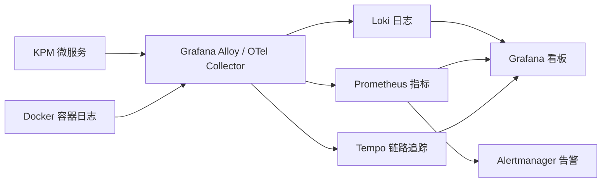

# KPM 性能、缓存、消息与可观测性方案

更新时间：2026-06-05

## 1. 本轮已落地的性能优化

### 后端分页与搜索下沉

以下高增长列表已新增后端分页接口，分页、关键字和主要过滤条件由 PostgreSQL 执行，前端不再为了表格分页拉取全量数据：

| 模块 | 分页接口 | 关键过滤条件 |
| --- | --- | --- |
| 项目管理 | `GET /api/projects/page` | `keyword`, `archived`, `page`, `pageSize` |
| 客户管理 | `GET /api/customers/page` | `keyword`, `page`, `pageSize` |
| 任务管理 | `GET /api/tasks/page` | `keyword`, `status`, `category`, `customerId`, `projectId`, `id`, `userId`, `assignee`, `scope`, `statusScope` |
| 订单管理 | `GET /api/orders/page` | `keyword`, `year`, `customerId`, `projectId`, `orderType`, `status` |
| 内部消息 | `GET /api/notifications/messages/page` | `unreadOnly`, `page`, `pageSize` |

列表接口返回轻量 DTO：列表只保留表格所需字段；阶段详情、客户联系人、任务评论附件、订单修改历史等重数据由详情接口按需加载。

### 前端数据加载调整

前端启动时不再拉取项目、客户、任务、订单全量数据。主列表页面改为页面级 Query：

- `ProjectsPage` 使用 `/api/projects/page`
- `CustomersPage` 使用 `/api/customers/page`
- `TasksPage` 使用 `/api/tasks/page`
- `OrdersPage` 使用 `/api/orders/page`
- `ProjectDetailPage` 独立调用 `/api/projects/{id}`
- 客户、任务、订单列表点击详情时再调用对应详情接口

## 2. 缓存策略

本轮已改为使用 **Valkey/Redis 兼容缓存**，由后端服务通过 `StringRedisTemplate` 写入 Redis JSON 缓存，不再使用 JVM 本地缓存。缓存具备：

- TTL 过期时间，并由 Nacos/env 参数集中配置；
- TTL 随机抖动，降低缓存雪崩风险；
- 单 key Redis 短锁，降低缓存击穿风险；
- Redis 异常时降级为直接查询数据库，避免缓存故障拖垮核心接口；
- JSON 字符串存储，便于在 Redis CLI 中观测，也避免 Java 序列化带来的版本兼容风险。

当前缓存对象：

| 服务 | 缓存对象 | TTL | 说明 |
| --- | --- | --- | --- |
| resource-service | `bootstrap` 配置数据 | 60s + 20s jitter | 用户、部门、角色、权限、枚举、任务状态流转 |
| analytics-service | 工作台统计 | 30s + 10s jitter | 高频展示，但允许短暂延迟 |
| analytics-service | 订单统计 | 90s + 30s jitter | 图表统计，适合短缓存 |
| analytics-service | 资源地图 | 10min + 2min jitter | 地址地理编码和地图数据较重 |
| analytics-service | 技术支持统计 | 60s + 20s jitter | 支持按客户维度缓存 |
| analytics-service | 客户活跃度 | 3min + 45s jitter | 活跃度矩阵允许分钟级延迟 |

当前缓存已经由 Valkey/Redis 统一承载，可支持后续多实例部署。resource-service 在用户、部门、角色、权限、枚举和任务状态流转配置变更后会主动删除 `kpm:cache:resource:bootstrap:v1`；analytics-service 的统计数据采用短 TTL，允许秒级/分钟级延迟。

## 3. 消息通知与 MQ 现状

当前 KPM 没有引入 RabbitMQ/Kafka/RocketMQ 等外部 MQ。消息通知采用的是数据库 Outbox 模式：

1. 业务服务写入 `kpm_notification_events`；
2. notification-service 定时异步消费事件；
3. 消费后写入 `kpm_internal_messages`，邮件发送预留。

本轮已增强：

- 事件抢占：`PENDING -> PROCESSING -> PROCESSED`；
- `FOR UPDATE SKIP LOCKED` 防止多实例重复抢同一事件；
- `retry_count`, `locked_at`, `last_error` 支持失败重试和问题定位；
- `source_event_id + recipient_user_id + message_type` 唯一索引，保证重复消费时消息幂等；
- 超时 `PROCESSING` 事件可被重新抢占，避免实例崩溃后事件永久卡住。

后续如果并发和消息量上升，建议引入 RabbitMQ 作为第一阶段外部 MQ。KPM 的业务通知属于可靠通知、削峰和异步发送场景，RabbitMQ 比 Kafka 更轻、更易维护，也更适合当前阶段。

## 4. 微服务调用现状

当前调用方式：

- 前端通过 Spring Cloud Gateway 访问后端；
- Gateway 通过 Nacos 服务发现路由到各微服务；
- 业务微服务之间目前没有系统化 RPC 调用；
- 数据聚合主要通过共享数据库表、读模型查询和 Outbox 事件完成。

当前阶段不建议急于引入 Dubbo/gRPC。更稳妥的路线：

1. 保持对外 HTTP REST + Gateway；
2. 内部少量同步查询使用 OpenFeign 或 WebClient，并加超时、重试、熔断；
3. 跨服务状态变更优先通过 Outbox/MQ 异步解耦；
4. 后续服务边界稳定后，再评估是否需要 RPC。

## 5. 开源日志、监控和自动化维护推荐

推荐优先采用 Grafana 生态的 LGTM/Prometheus 方案：

建议落地顺序：

1. **第一阶段：日志集中化**
   - Grafana + Loki + Grafana Alloy。
   - 先把所有 Docker 容器日志集中到 Loki，在 Grafana 里按服务名、环境、traceId 查询。

2. **第二阶段：服务监控**
   - Spring Boot Actuator + Micrometer + Prometheus + Grafana。
   - 监控 JVM、HTTP 延迟、错误率、数据库连接池、接口 QPS。

3. **第三阶段：告警**
   - Prometheus Alertmanager。
   - 先做基础告警：服务不可用、5xx 激增、接口 P95 延迟高、PostgreSQL 连接池耗尽、磁盘空间不足。

4. **第四阶段：链路追踪**
   - OpenTelemetry + Tempo。
   - 用 traceId 串联 gateway、project-service、task-service、order-service、notification-service。

可选替代方案：

| 方案 | 优点 | 代价 | 建议 |
| --- | --- | --- | --- |
| Grafana + Loki + Prometheus + Tempo | 轻量、开源、和云原生/Docker/K8s 适配好 | 日志全文检索弱于搜索引擎型方案 | KPM 首选 |
| OpenSearch | 日志搜索能力强，适合复杂查询和长周期留存 | 资源消耗更高，维护复杂 | 日志量大或需要复杂检索时再上 |
| ELK/Elastic Stack | 生态成熟，文档多 | 部分能力许可复杂，资源消耗偏高 | 不作为当前免费优先方案 |

## 6. 下一步建议

1. 引入 Spring Boot Actuator 和 Micrometer 指标，暴露 `/actuator/prometheus`；
2. 增加 traceId/requestId 日志字段，统一 JSON 日志格式；
3. 将更多读多写少的跨服务配置和权限计算结果接入 Valkey/Redis，并通过事件做主动失效；
4. 为分页接口补充慢查询 `EXPLAIN ANALYZE` 样本，逐步引入 `pg_trgm` 优化 `ILIKE` 搜索；
5. 把 notification-service 的 Outbox 配置放入 Nacos，例如批次大小、重试次数、锁超时时间。
