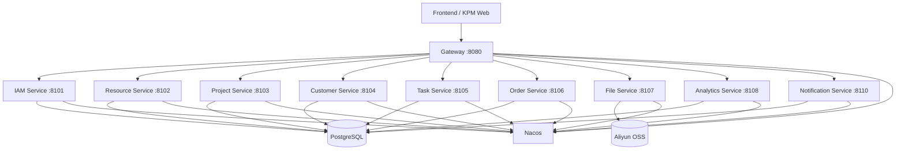

# KPM（Kozen Project Management）项目介绍

更新时间：2026-06-03
工作目录：`/Users/henry/Documents/KPM`

## 1. 项目定位

KPM 是 Kozen 内部使用的产品项目协作系统，目标是把 POS 产品从立项、研发、测试、客户推广、订单、交付、维护过程中的项目信息、客户信息、任务、资料、订单和统计统一到一个系统里。

当前版本定位为 **可试点版本**，不是正式生产终态。它已经具备核心试用能力，但从优秀 CTO/架构负责人视角看，仍需要继续补齐自动化测试、前端工程化拆分、完整 OAuth2/SSO 能力、消息 MQ 化、生产级高可用部署和观测体系。

## 2. 当前已完成/落实的能力

### 2.1 前端页面与交互

- 登录页已调整为科技风视觉，展示 KOZEN slogan：`KOZEN, TO COLLABORATE WITH GLOBAL LEADERS`。
- 左侧菜单支持收缩/展开，为主内容区释放空间。
- 顶部保留消息盒子；用户菜单移动到左下角圆形用户图标。
- 权限授予支持一次性多选，避免逐个点击。
- 客户、任务、项目成员、负责人等人员选择改为搜索式选择，不允许把不存在的人员直接落库。
- 项目创建成功后返回项目列表，避免停留空白页。
- 任务支持客户字段；未指定客户时表示“中性/适用于所有客户”。
- 订单增加状态、SKU 选择、订单详情展示；列表只展示基础信息，详情页展示完整信息，避免表格变形。
- 项目详情增加 SKU 管理入口，当前 SKU 字段：整机料号、配置名称、内存类型。
- 任务长标题在列表中做省略展示，避免撑坏 UI。

### 2.2 后端与数据联动

- 后端已从早期 Controller/Map 直写逐步重构为 Controller / Service / ServiceImpl / Mapper 分层。
- Mapper 已切换到 MyBatis 注解 SQL，不再依赖原来的 JDBC Map Mapper。
- 新增订单状态枚举，资源管理中可配置，并可被订单实际使用。
- 新增项目 SKU 表，订单下单时选择 SKU，并保存 SKU 快照。
- OSS 文件上传已经接入真实阿里云 OSS，根目录为 `oss://xc-kozen-sh-fw/KPM/`。
- 文件下载链接使用 OSS 签名 URL，并强制 `Content-Disposition: attachment`，避免 txt 等文件直接在浏览器打开。
- 消息增加已读/未读状态；已读消息超过 15 天会逻辑删除。
- 主业务表删除逐步统一为 `del_flag=1` 逻辑删除，列表/详情查询按 `del_flag=0` 过滤。

### 2.3 本地数据状态

已经执行手动测试数据清理脚本：

- 用户：仅保留 1 个管理员用户。
- 项目、客户、任务、订单：已清空。
- 权限、枚举、流程模板：保留，方便继续手动录入测试。

管理员账号：`admin@kozenmobile.com`
默认密码：`123456`

## 3. 技术架构方案

### 3.1 技术栈

| 层级 | 当前技术 | 说明 |
|---|---|---|
| JDK | Eclipse Temurin / Java 21 LTS | 免费 JDK，适合长期维护。 |
| 后端框架 | Spring Boot 4 / Spring Cloud Gateway | 微服务 + 网关模式。 |
| 配置中心/注册中心 | Nacos 3.1.1 | 服务配置、服务发现。 |
| 数据库 | PostgreSQL 18 | 免费开源；适合复杂业务关系和统计查询。 |
| ORM/SQL | MyBatis | 当前采用注解 SQL；后续建议复杂 SQL 迁移 XML 或 DSL。 |
| 文件存储 | 阿里云 OSS | 文件上传/下载真实落 OSS。 |
| 缓存 | Valkey | 免费 Redis 兼容方案，当前主要作为基础设施预留。 |
| 消息 | 当前为 DB 事件表；RocketMQ Compose profile 已预留 | V1 先用 `kpm_notification_events` 表驱动内部消息；生产建议正式接入 MQ。 |
| 前端 | Vite + React 壳 + prototype-runtime | 当前页面主体仍是 prototype runtime；后续必须拆成正式 React 页面/组件/hooks/types。 |
| 接口文档 | SpringDoc Swagger | 每个后端服务暴露 `/swagger-ui.html` 与 `/v3/api-docs`。 |
| 容器部署 | Docker Compose | 已统一到一个 compose 文件和 `.env` 配置。 |

### 3.2 微服务划分



## 4. 关键访问地址

本地开发环境：

| 功能 | 地址 |
|---|---|
| 前端 Vite Preview | `http://127.0.0.1:4173/` |
| 前端 prototype runtime | `http://127.0.0.1:4173/prototype-runtime/index.html` |
| Gateway | `http://127.0.0.1:8080` |
| Nacos API | `http://127.0.0.1:8848` |
| Nacos Console | `http://127.0.0.1:8849/` |
| Swagger 示例 | `http://127.0.0.1:8101/swagger-ui.html` |

> 注意：Nacos 3 的控制台端口映射为 `8849`，路径是 `/`，不是旧版本的 `/nacos/`。

## 5. 部署与本地启动

### 5.1 一键 Docker Compose

在完整项目目录中执行：

```bash
cd /Users/henry/Documents/KPM
cp .env.example .env
# 如需 OSS/邮箱等外部能力，先编辑 .env 或通过脚本写入 Nacos
docker compose -f infra/docker-compose/dev/docker-compose.yml up -d
```

说明：

- Compose 会启动 PostgreSQL、Valkey、Nacos、后端服务、前端服务。
- `nacos-config-publisher` 会在启动时把服务端口、数据库、Gateway、文件服务、通知服务等配置发布到 Nacos。
- OSS 密钥不会写入 Git。首次在新机器部署时，应在 `.env` 中填写 OSS 相关变量，或使用 `scripts/nacos-put-oss-config.sh` 发布到 Nacos。
- Nacos 本地持久化目录为 `/Users/henry/Documents/KPM/.local/nacos`，该目录已加入 `.gitignore`。

### 5.2 常用开发脚本

```bash
# 启动基础设施并发布 Nacos 配置
./scripts/dev-infra-up.sh

# 构建后端
./scripts/backend-build-docker.sh

# 启动/重启所有后端开发容器
./scripts/dev-backend-smoke-up.sh

# 清空业务数据，只保留管理员
./scripts/db-clear-for-manual-test.sh

# 前端构建
cd apps/frontend/kpm-web && npm run build
```

## 6. 前后端如何通信

### 6.1 调用方式

前端通过 `/Users/henry/Documents/KPM/apps/frontend/kpm-web/public/prototype-runtime/api.js` 中的 `createKpmApi` 调用后端：

- JSON 接口：`fetch + application/json`
- 文件上传：`multipart/form-data`
- 鉴权头：`Authorization: Bearer <token>`
- 开发环境 API Base：默认 `http://127.0.0.1:8080`

### 6.2 鉴权与权限

当前是轻量级 Bearer Token + Gateway RBAC：

- 登录接口：`POST /api/iam/login`
- 登录后返回 token、用户信息、角色和权限。
- Gateway 验证 token 并注入用户上下文。
- 菜单权限和按钮权限由后端权限表生成，前端按权限隐藏入口，后端 Gateway 继续做真实权限校验。

当前还不是完整 OAuth2 Authorization Server。生产建议：

1. 引入 Spring Authorization Server 或 Keycloak。
2. 使用标准 OAuth2/OIDC token。
3. 对 token 增加刷新、吊销、设备管理和审计。
4. 将 Gateway RBAC 继续作为接口级权限边界。

### 6.3 数据校验

当前已有两层校验：

- 前端：必填、邮箱格式、长度、人员选择必须来自已有用户、提交/删除二次确认、toast 分级提示。
- 后端：DTO + Bean Validation + `ValidationUtil` + 全局异常处理。

仍需继续加强：

- SQL 层唯一性和外键完整性。
- DTO 覆盖率还要继续提高，部分接口仍有 Map 参数或 Map 返回。
- 文件 MIME/扩展名安全策略可进一步细化。

## 7. 数据库设计摘要

### 7.1 公共字段标准

当前所有 `kpm_%` 表通过 schema/migration 补充了公共字段：

| 字段 | 说明 |
|---|---|
| `id` | 当前 V1 大多数表仍使用字符串业务 ID；这是兼容当前前端和已有关系的阶段性设计。 |
| `creator` | 创建者 ID/标识。 |
| `updator` | 修改者 ID/标识。 |
| `create_time` | 创建时间。 |
| `update_time` | 最后修改时间。 |
| `del_flag` | 逻辑删除标记，`0` 存在，`1` 删除。 |

CTO 评审意见：后续正式版建议把技术主键统一改成 `BIGSERIAL/BIGINT`，把当前字符串 ID 移到 `biz_code` 或业务编号字段。这样更符合大型系统长期演进标准。

### 7.2 表结构清单

以下为当前本地 PostgreSQL 中的主要表和字段摘要：

| 表名 | 说明 | 主要字段 |
|---|---|---|
| `kpm_users` | 用户 | `id`, `account`, `email`, `name`, `password_hash`, `status`, 公共字段 |
| `kpm_departments` | 部门 | `id`, `name`, `status`, 公共字段 |
| `kpm_roles` | 角色 | `id`, `name`, `role_type`, `status`, 公共字段 |
| `kpm_permissions` | 菜单/按钮权限 | `id`, `code`, `name`, `permission_type`, `target`, `location`, 公共字段 |
| `kpm_user_departments` | 用户-部门关系 | `user_id`, `department_id`, 公共字段 |
| `kpm_user_roles` | 用户-角色关系 | `user_id`, `role_id`, 公共字段 |
| `kpm_user_permissions` | 用户直接权限 | `user_id`, `permission_id`, 公共字段 |
| `kpm_role_permissions` | 角色权限 | `role_id`, `permission_id`, 公共字段 |
| `kpm_enum_items` | 资源枚举 | `id`, `enum_type`, `name`, `value`, `semantic`, `active`, `sort_order`, 公共字段 |
| `kpm_projects` | 项目主表 | `id`, `external_name`, `internal_name`, `model_name`, `manager_user_id`, `manager_account`, `status`, `salesability`, `unsellable_reason`, `archived`, 公共字段 |
| `kpm_project_stages` | 项目阶段 | `id`, `project_id`, `stage_name`, `stage_order`, `status`, 公共字段 |
| `kpm_stage_assignees` | 阶段负责人 | `id`, `stage_id`, `assignee_type`, `assignee_name`, `account`, `user_id`, 公共字段 |
| `kpm_stage_materials` | 阶段资料 | `id`, `stage_id`, `file_name`, `bucket`, `object_key`, `storage_url`, `published_to_project`, 公共字段 |
| `kpm_stage_records` | 阶段留言/记录 | `id`, `stage_id`, `author`, `content`, `attachments`, 公共字段 |
| `kpm_project_materials` | 项目资料区 | `id`, `project_id`, `source_stage`, `file_name`, `bucket`, `object_key`, `storage_url`, 公共字段 |
| `kpm_project_members` | 项目成员 | `id`, `project_id`, `user_id`, `user_account`, `role_name`, 公共字段 |
| `kpm_project_skus` | 项目 SKU | `id`, `project_id`, `whole_machine_part_number`, `configuration_name`, `memory_type`, `active`, 公共字段 |
| `kpm_project_customers` | 项目-客户关联 | `id`, `project_id`, `customer_id`, `project_status`, 公共字段 |
| `kpm_customers` | 客户主表 | `id`, `name`, `short_name`, `region`, `address`, `level`, `status`, 公共字段 |
| `kpm_customer_owners` | 客户负责人 | `id`, `customer_id`, `owner_type`, `owner_user_id`, `owner_name`, 公共字段 |
| `kpm_customer_contacts` | 客户联系人 | `id`, `customer_id`, `name`, `title`, `phone`, `email`, `remark`, 公共字段 |
| `kpm_customer_materials` | 客户资料 | `id`, `customer_id`, `file_name`, `bucket`, `object_key`, `storage_url`, 公共字段 |
| `kpm_customer_followups` | 客户跟进记录 | `id`, `customer_id`, `author`, `content`, `attachments`, 公共字段 |
| `kpm_requirements` | 客户需求 | `id`, `project_id`, `customer_id`, `title`, `user_story`, `business_value`, `acceptance`, `priority`, `status`, `task_id`, 公共字段 |
| `kpm_tasks` | 任务 | `id`, `title`, `description`, `project_id`, `stage_id`, `customer_id`, `category`, `status`, `priority`, `creator_user_id`, `expected_completion_at`, `blocked`, 公共字段 |
| `kpm_task_assignees` | 任务执行人 | `task_id`, `user_id`, `assignee_name`, 公共字段 |
| `kpm_task_participants` | 任务参与人 | `task_id`, `user_id`, `participant_name`, 公共字段 |
| `kpm_task_attachments` | 任务附件 | `id`, `task_id`, `file_name`, `bucket`, `object_key`, `storage_url`, 公共字段 |
| `kpm_task_comments` | 任务评论 | `id`, `task_id`, `author`, `content`, `attachments`, 公共字段 |
| `kpm_task_status_transitions` | 任务状态流转配置 | `id`, `from_status`, `to_status`, 公共字段 |
| `kpm_orders` | 订单 | `id`, `order_date`, `customer_id`, `project_id`, `sku_id`, `sku_snapshot`, `order_type`, `status`, `quantity`, `expected_ship_date`, `actual_ship_date`, `currency`, `unit_price`, `amount`, `creator_user_id`, 公共字段 |
| `kpm_order_histories` | 订单修改记录 | `id`, `order_id`, `modifier`, `modified_at`, `changes`, `reason`, 公共字段 |
| `kpm_notification_events` | 通知事件 | `id`, `event_type`, `aggregate_type`, `aggregate_id`, `recipient_user_ids`, `payload`, `status`, `processed_at`, 公共字段 |
| `kpm_internal_messages` | 内部消息 | `id`, `recipient_user_id`, `title`, `content`, `message_type`, `read_flag`, `read_at`, `del_flag` |
| `kpm_geocode_cache` | 地址转经纬度缓存 | `query`, `latitude`, `longitude`, `display_name`, `provider`, `precision`, 公共字段 |
| `kpm_process_templates` | 流程模板 | `id`, `name`, `scope`, `status`, `updated_at`, 公共字段 |
| `kpm_template_stages` | 模板阶段 | `id`, `template_id`, `stage_name`, `sort_order`, 公共字段 |
| `kpm_prototype_snapshots` | 原型状态快照 | `id`, `state`, `updated_by`, `updated_at`, 公共字段 |

## 8. 配置中心与 OSS

### 8.1 Nacos 管理内容

Nacos 中维护每个服务的：

- 服务端口。
- 数据库连接。
- Gateway CORS / IAM URI / 鉴权开关。
- 文件服务 OSS 配置。
- 通知服务刷新频率、邮件配置。
- 统计服务地理编码配置。

### 8.2 OSS 状态

文件服务读取 Nacos 中的：

```yaml
kpm:
  oss:
    enabled: true
    endpoint: ...
    bucket: xc-kozen-sh-fw
    root-prefix: KPM/
    access-key-id: <由 Nacos 管理，不提交 Git>
    access-key-secret: <由 Nacos 管理，不提交 Git>
```

已验证：

- `GET /api/files/oss/status` 返回 `ready=true`。
- `POST /api/files/upload` 可上传真实文件到 OSS。
- `GET /api/files/download-url` 可返回带下载头的签名 URL。

## 9. 消息与 MQ 当前状态

当前通知采用两层表：

1. 业务服务写入 `kpm_notification_events`。
2. Notification Service 轮询事件，生成 `kpm_internal_messages`。
3. 前端每 2 分钟刷新消息数量和列表，刷新间隔由 Nacos 配置。

RocketMQ 已在 Compose 中作为 `mq` profile 预留，但当前业务代码还没有正式使用 RocketMQ 发布/消费消息。

CTO 建议：试点版可以继续用 DB 事件表；正式生产版应迁移到 MQ，并保留本地事务 + outbox pattern，避免业务写入成功但消息丢失。

## 10. 当前验证结果

2026-06-03 已完成以下验证：

| 验证项 | 结果 |
|---|---|
| 前端构建 `npm run build` | 通过 |
| 后端构建 `./scripts/backend-build-docker.sh` | 通过 |
| Docker Compose 配置校验 | 通过 |
| Gateway health | 通过 |
| 管理员登录接口 | 通过 |
| 带 Origin 的前端登录 CORS 请求 | 通过 |
| Nacos file-service OSS 配置 | `enabled=true`, `ready=true` |
| OSS 文件上传 | 通过 |
| OSS 下载签名 URL | 通过，包含 attachment 下载头 |
| 手动测试数据清理 | 已执行，只保留管理员 |

Browser 插件已验证登录页视觉和非空渲染。由于插件当前文本输入路径依赖虚拟剪贴板，完整 UI 登录点击流程没有在插件内完成；后端登录接口和 CORS 已用 HTTP 请求验证通过。

## 11. CTO 级评审结论

### 11.1 代码层面

当前状态：**可继续试点开发，但未达到大厂生产级代码标准。**

已经改善：

- 后端已引入 MyBatis。
- 大部分业务已经进入 Controller / Service / Mapper 分层。
- DTO + Bean Validation 正在覆盖主要写接口。
- 权限由前端隐藏 + 后端 Gateway 校验共同承担。
- OSS、订单、SKU、消息等核心链路已经可真实落库/落 OSS。

仍需重点改进：

1. 前端主体仍是较大的 prototype runtime 文件，后续必须拆成正式 React 页面、组件、hooks、types、i18n、validation、API client 模块。
2. 后端仍存在部分 Map 返回/Map 组装，应继续引入 Entity / DTO / VO / Converter。
3. 当前字符串 ID 是阶段性兼容方案，长期建议迁移为 BIGINT 技术主键 + 业务编号。
4. 自动化测试不足，缺少单元测试、集成测试、权限回归测试、文件上传回归测试。
5. Swagger 有，但接口文档质量还需继续补充业务说明、请求示例、错误码说明。
6. 逻辑删除已经开始统一，但关系表和历史表的删除/重建策略还需形成正式规范。

### 11.2 架构层面

当前状态：**具备微服务雏形，适合本地/试点部署；尚未达到高可用生产部署标准。**

优点：

- 服务拆分清晰：IAM、资源、项目、客户、任务、订单、文件、统计、通知、网关。
- 配置中心和注册中心已使用 Nacos。
- 文件使用 OSS，避免本地磁盘成为单点。
- 数据库使用 PostgreSQL，适合复杂关系和统计。
- Compose 已统一部署入口，迁移到新机器更容易。

生产化缺口：

1. 单机 Docker Compose 不是高可用，只能作为开发/试点环境。
2. PostgreSQL 需要主从、备份、恢复演练和慢查询监控。
3. Nacos 生产需要集群部署。
4. Gateway 和后端服务需要多实例 + 负载均衡。
5. 通知需要 MQ 化，RocketMQ/RabbitMQ/Kafka 三选一后落地。
6. 缺少 Prometheus/Grafana/日志链路追踪/告警。
7. 文件上传需要补充病毒扫描、类型白名单/黑名单、访问权限控制策略。
8. 权限体系需要补充审计日志和数据权限，例如客户/项目维度的数据可见范围。

### 11.3 是否可部署投入使用

结论：**可以进入小范围内部试点，不建议直接作为全公司生产系统上线。**

试点建议：

- 用户数量：先控制在 5–20 个真实用户。
- 数据范围：先录入少量项目、客户、订单和任务。
- 目标：验证流程是否符合业务认知、权限是否符合管理方式、订单/SKU/客户关联是否顺手。
- 不建议此阶段承载公司级核心生产数据。

## 12. 下一步规划建议

优先级建议如下：

1. **前端正式工程化重构**：把 prototype runtime 拆成 React 页面、组件、hooks、types、validation、API 模块。
2. **后端 DTO/Entity/Converter 完整化**：逐步消灭 Map 参数和 Map 返回。
3. **自动化测试**：先补登录、权限、客户、项目、任务、订单、文件上传、OSS 下载 URL 的集成测试。
4. **权限回归测试**：验证部分权限用户只能看到授权菜单/按钮，后端接口也无法越权。
5. **消息 MQ 化**：用 outbox pattern + MQ 替换当前纯 DB 轮询通知。
6. **生产部署方案**：规划 PostgreSQL 主从、Nacos 集群、Gateway 多实例、服务多实例、统一日志和监控。
7. **数据库主键重构**：从字符串业务 ID 逐步迁移到 BIGINT 技术主键。
8. **正式 PRD/接口冻结**：在试点反馈后冻结 V1 范围，进入更标准的软件工程节奏。

---

当前我对 KPM 的判断是：方向对，业务价值清晰，原型已经接近可以试用；但代码和架构还应该继续“打磨成系统”，而不是急着把原型当生产系统。下一阶段最值得投入的是：**真实试点 + 前端工程化 + 后端 DTO/Entity 标准化 + 自动化测试**。
